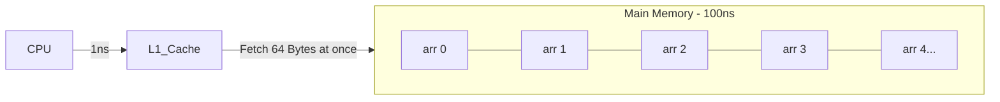

# 01_Arrays: Masterclass Theory & Internal Architecture

Welcome to the comprehensive deep-dive into Arrays. In this module, we will bypass surface-level definitions and explore arrays from the hardware level up to the JVM implementation, preparing you for the most rigorous Systems and DSA interviews at companies like Google, Meta, and HFTs.

---

## 1. The Hardware Perspective: CPU Caches & Spatial Locality

To truly master arrays, you must understand how they interact with the computer's hardware, specifically the CPU cache.

### The Memory Hierarchy
When a CPU needs data, it doesn't fetch it directly from RAM. It checks its caches first (L1, L2, L3). Fetching from L1 takes ~1 ns, while fetching from Main Memory (RAM) takes ~100 ns. 

### Cache Lines and Spatial Locality
Memory is transferred from RAM to Cache in blocks called **Cache Lines** (typically 64 bytes). 
Because an array is an **unbroken, contiguous block of memory**, accessing `array[0]` forces the CPU to load `array[0]` through `array[15]` (assuming 4-byte integers) into the ultra-fast L1 cache.

This phenomenon is called **Spatial Locality of Reference**.



**Interview Goldmine:** If an interviewer asks: *"Why is iterating an Array of 1 million integers faster than iterating a LinkedList of 1 million integers, even though both are $O(N)$?"*
**Your Answer:** *"Because of Cache Locality. An array's contiguous memory layout means a single RAM fetch brings multiple sequential elements into the CPU L1 cache. A LinkedList's nodes are scattered across the heap, causing constant Cache Misses and forcing the CPU to wait 100x longer to fetch each node directly from RAM."*

---

## 2. Java Virtual Machine (JVM) Implementation

In Java, arrays are dynamically allocated **Objects**, not bare memory pointers like in C/C++. 

### JVM Memory Layout of an Array
When you declare `int[] arr = new int[5];`, the JVM allocates memory on the Heap. The layout looks like this:

1. **Mark Word (8 bytes)**: Used for garbage collection, hashing, and locking.
2. **Class Pointer (4-8 bytes)**: Points to the metadata of the array class (e.g., `[I` for int array).
3. **Array Length (4 bytes)**: This is why `arr.length` is an $O(1)$ operation in Java. The length is literally stored in the object header.
4. **Padding (0-4 bytes)**: JVM objects are aligned to 8-byte boundaries.
5. **Actual Data (N * size_of_type)**: 5 * 4 bytes = 20 bytes for the integers.

### 2D Arrays in Java (Arrays of Arrays)
Unlike C/C++, where `int arr[3][3]` is a single flat contiguous block of 9 integers, **Java 2D arrays are arrays of references**.

```java
int[][] matrix = new int[3][3];
```
- `matrix` is a reference pointing to an array of 3 references.
- Each of those 3 references points to an independent 1D array of 3 integers in the heap.
- **Performance Impact**: Iterating a Java 2D array row-by-row is fast. Iterating column-by-column causes massive cache misses because you are jumping between completely different objects in the heap.

---

## 3. Advanced Mathematical Analysis & Complexities

### The Indexing Formula
How does `arr[i]` achieve absolute $O(1)$ time regardless of array size? 
Through a single hardware-level CPU addition and multiplication instruction:

`Memory_Address = Base_Address + (Index * Size_Of_Element_In_Bytes)`

*Example:* `int[] arr` starts at `0x1000`. You want `arr[5]`.
`Address = 0x1000 + (5 * 4) = 0x1014`. The CPU jumps directly to `0x1014`.

### Amortized Analysis of Dynamic Arrays (`ArrayList`)
Static arrays cannot grow. `ArrayList` solves this by resizing. 

**The Resizing Mechanism (Java 8+):**
1. When capacity is reached, a new array is created with size `oldCapacity + (oldCapacity >> 1)` (i.e., $1.5\times$ larger).
2. `System.arraycopy()` (a blazing fast native C/C++ method using CPU vectorization/SIMD) copies the data.

**Why $1.5\times$ and not $2\times$?**
If you multiply by 2, the new allocation is always larger than the sum of all previous allocations combined. This means the JVM can never reuse the memory footprint left behind by older arrays. A growth factor of 1.5 allows the new array to eventually fit into the memory space freed by the garbage collector from earlier arrays.

**Amortized Cost Proof:**
If we start with capacity 1 and double it, adding $N$ elements requires resizing at $1, 2, 4, 8... \approx N$. 
Total copy operations = $1 + 2 + 4 + ... + N/2 = N - 1$.
Adding $N$ elements takes $N$ regular inserts + $N$ copy operations = $2N$ operations.
$2N / N = 2$ operations per insert. Thus, insertion is **Amortized $O(1)$**.

---

## 4. The 7 Core Array Patterns

Mastering arrays means mastering the patterns they enable. We will cover each in depth in the `07_Patterns_And_Tricks.md` file, but here is the taxonomy you must memorize:

1. **Two Pointers (Opposite Direction)**: Used for reversing, finding pairs in sorted arrays, or container with most water.
2. **Two Pointers (Same Direction / Fast & Slow)**: Used for in-place modifications (removing duplicates) or cycle detection.
3. **Sliding Window (Fixed)**: Used for max sum subarray of size K.
4. **Sliding Window (Variable)**: Used for longest subarray with condition X (requires HashMaps/Sets often).
5. **Prefix Sum (Pre-computation)**: $P[i] = P[i-1] + arr[i]$. Reduces range sum queries from $O(N)$ to $O(1)$.
6. **Kadane's Algorithm**: Dynamic programming on arrays. Local optimal choice leads to global optimal (Max Subarray Sum).
7. **Dutch National Flag (3-Way Partitioning)**: Sorting arrays with 3 distinct values in $O(N)$ time and $O(1)$ space using 3 pointers.

---

## 5. Interview Strategy: The "Array Checklist"

When an interviewer gives you an array problem, immediately run through this mental checklist out loud. This demonstrates seniority and defensive programming skills:

1. **"Is the array sorted?"** 
   - *If yes:* Binary Search ($O(\log N)$) or Two Pointers ($O(N)$).
   - *If no:* Can I sort it? Is $O(N \log N)$ acceptable? Or should I use a HashMap ($O(N)$ time, $O(N)$ space)?
2. **"Does it contain negative numbers?"**
   - Critical for Sliding Window problems. (Variable sliding window typically fails if negatives are present because the window sum doesn't monotonically increase/decrease).
3. **"Can there be duplicate elements?"**
   - Affects Two Pointers and Binary Search logic.
4. **"What is the maximum size of the array?"**
   - If $N = 10^5$, an $O(N^2)$ brute force will Result in TLE (Time Limit Exceeded). You must find an $O(N \log N)$ or $O(N)$ solution.
   - If $N = 10^9$, even $O(N)$ is too slow. You need $O(\log N)$ (Binary search) or $O(1)$ (Math).
5. **"Can I modify the array in-place?"**
   - If yes, you can use the array itself as a hash table by negating values at indices (e.g., Finding missing numbers).

---

## 6. Advanced Edge Cases & Traps

- **Integer Overflow**: If you are calculating `Prefix Sums` or `Max Subarray`, an array of large integers will overflow Java's 32-bit signed `int`. Always clarify if you should use `long`.
- **Off-By-One Errors**: `for (int i = 0; i <= arr.length; i++)` will throw `ArrayIndexOutOfBoundsException`.
- **Concurrent Modification**: Modifying an array while iterating via streams or standard loops requires explicit handling.
- **Zero Length**: Always write `if (arr == null || arr.length == 0) return X;` as your very first line.

---

## 7. Deep Dive: In-Place Array Hashing (The Cyclic Sort Pattern)

This is a FAANG favorite. 
**Scenario:** You are given an array of size $N$ containing numbers from $1$ to $N$. Find the missing number. 
**Constraint:** $O(N)$ time, $O(1)$ extra space. You cannot use a HashSet.

**The Solution:** Use the array itself as the hash map. 
Since values are $1 \to N$ and indices are $0 \to N-1$, we can put every number at its "correct" index.
Value `x` belongs at index `x - 1`.

Iterate through the array. If `arr[i]` is not at `arr[arr[i] - 1]`, swap them. 
This puts every element in its correct bucket in $O(N)$ time without extra space.

```java
// Cyclic Sort Implementation Concept
for (int i = 0; i < nums.length; ) {
    int correctIndex = nums[i] - 1;
    // Ensure the number is within bounds and not already at its correct position
    if (nums[i] > 0 && nums[i] <= nums.length && nums[i] != nums[correctIndex]) {
        swap(nums, i, correctIndex);
    } else {
        i++; // Move to the next only if current index holds the correct element or is out of bounds
    }
}
```
This demonstrates the absolute highest level of array mastery: utilizing the structure's implicit mathematical properties (indices mapping to values) to bypass space complexity limitations.
