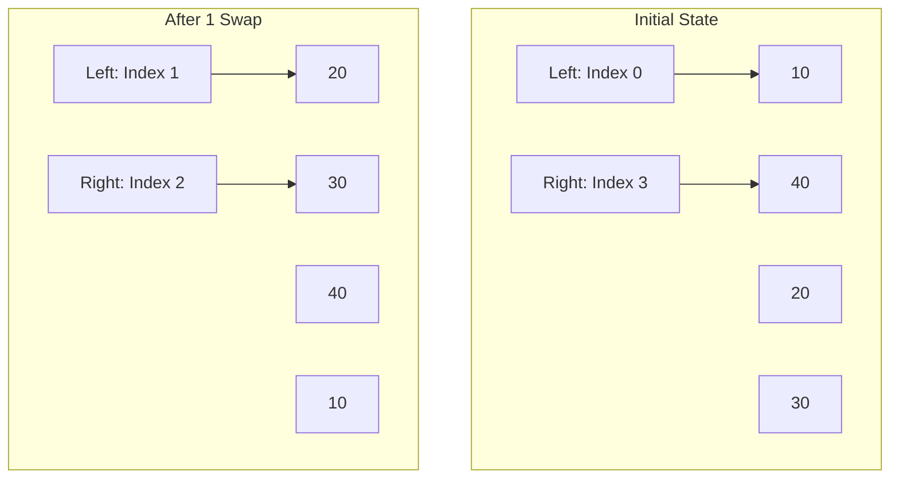

# 01_Arrays: Masterclass Basic Examples

While these problems are categorized as "Basic", they are the foundational building blocks for complex algorithms. In FAANG interviews, a basic problem is often used as a warm-up to test your coding hygiene, edge-case awareness, and ability to communicate tradeoffs.

---

## Example 1: Find the Largest Element (The Art of the Linear Scan)

**Problem Statement:** Given an array of integers $A$ of size $N$, find the maximum element present in it.

### The Interview Dialogue Simulator
* **Interviewer:** "Find the maximum element in this array."
* **You:** "Are there any constraints on the array? Can it be empty or null? Are the numbers within standard integer bounds?"
* **Interviewer:** "It won't be null, but it could be empty. Numbers fit in a 32-bit signed integer."
* **You:** "Got it. A brute force approach would be to sort the array and take the last element, which costs $O(N \log N)$ time. But since we only need the maximum, we can optimize this to $O(N)$ time and $O(1)$ space by maintaining a running maximum while doing a single pass (Linear Scan)."

### Deep Approach Analysis: Single Pass Linear Scan
We initialize our `max` variable. 
**Crucial Trap:** Do not initialize `max` to `0`. If the array contains only negative numbers (e.g., `[-5, -2, -9]`), `0` will be returned incorrectly. Initialize it to `Integer.MIN_VALUE` or `arr[0]`.

### Production-Grade Java Code
```java
public class LargestElement {
    /**
     * Finds the maximum element in a given array.
     * 
     * @param arr The input array of integers.
     * @return The maximum integer found.
     * @throws IllegalArgumentException if the array is null or empty.
     */
    public static int findLargest(int[] arr) {
        // 1. Defensive Programming: Always guard against invalid input
        if (arr == null || arr.length == 0) {
            throw new IllegalArgumentException("Array cannot be null or empty");
        }
        
        // 2. Initialization: Using the first element prevents the negative number trap
        int max = arr[0]; 
        
        // 3. Execution: Start from index 1 to save one unnecessary comparison
        for (int i = 1; i < arr.length; i++) {
            if (arr[i] > max) {
                max = arr[i]; 
            }
        }
        
        return max;
    }
}
```

### Complexity Breakdown
- **Time Complexity:** $\Theta(N)$. We visit exactly $N-1$ elements. In a worst-case scenario (strictly increasing array), we perform $N-1$ assignments. In a best-case scenario (strictly decreasing), we perform $0$ assignments. The number of comparisons is always $N-1$.
- **Space Complexity:** $O(1)$. We allocate exactly one 32-bit integer (`max`), which sits in the JVM stack memory, not the heap.

---

## Example 2: Check if Array is Sorted (The Monotonicity Test)

**Problem Statement:** Given an array, check if it is sorted in non-decreasing order.

### Intuition: The Local vs. Global Property
A common mistake beginners make is trying to compare `arr[0]` with `arr[N-1]`. Sorting is a **global property** derived from a **local property**.
*Mathematical Theorem:* An array is globally sorted in non-decreasing order if and only if for every adjacent pair, $A[i] \leq A[i+1]$. 
By testing this local property iteratively, we verify the global state.

### Production-Grade Java Code
```java
public class CheckSorted {
    public static boolean isSorted(int[] arr) {
        // Edge cases: arrays of size 0 or 1 are inherently sorted by definition
        if (arr == null || arr.length <= 1) {
            return true; 
        }
        
        // Notice the loop bound is arr.length - 1 to prevent OutOfBounds
        for (int i = 0; i < arr.length - 1; i++) {
            // The Moment of Failure: If current > next, it breaks the monotonicity
            if (arr[i] > arr[i + 1]) {
                return false;
            }
        }
        return true;
    }
}
```

### Advanced Optimization: Loop Unrolling (Systems Level)
While the above code is $O(N)$, in extremely high-performance systems (like HFT), the loop overhead (incrementing `i`, evaluating `i < arr.length - 1`, branching logic) can be expensive. Compilers often use **Loop Unrolling** to process multiple elements per iteration to minimize branch prediction misses on the CPU.
*(Note: You don't need to code this in an interview, but mentioning that the JIT compiler unrolls this loop shows profound systems understanding).*

---

## Example 3: Reverse an Array (In-Place Memory Manipulation)

**Problem Statement:** Given an array, reverse its elements in-place.

### Approach 1: The Extra Memory Trap (Brute Force)
Creating a `new int[arr.length]` and copying elements backwards requires $O(N)$ Heap space. This triggers Garbage Collection and slows down the system. **Never do this in an interview unless specifically asked for a pure function that avoids mutating state.**

### Approach 2: The Two Pointer Technique (Optimal)
We place one pointer at the start (`left`) and one at the end (`right`). We swap their values, then move them towards the center until they cross.



### Production-Grade Java Code
```java
public class ReverseArray {
    public static void reverse(int[] arr) {
        if (arr == null || arr.length <= 1) return;
        
        int left = 0;
        int right = arr.length - 1;
        
        // We stop when left == right (odd length) or left > right (even length)
        while (left < right) {
            // Swap logic using a temporary variable
            int temp = arr[left];
            arr[left] = arr[right];
            arr[right] = temp;
            
            // Move pointers inward
            left++;
            right--;
        }
    }
    
    // Alternative Swap: Bitwise XOR (No Temp Variable)
    // Warning: Only use if arr[left] and arr[right] are distinct memory addresses!
    // arr[left] ^= arr[right];
    // arr[right] ^= arr[left];
    // arr[left] ^= arr[right];
}
```

### The XOR Swap Fallacy
Many candidates try to show off by using the XOR swap `a ^= b; b ^= a; a ^= b;`. 
**Do NOT do this in modern Java.**
1. It is fundamentally slower than using a `temp` variable because modern CPUs have dedicated Register Renaming and out-of-order execution that makes the `temp` variable swap execute in practically 0 cycles.
2. XOR creates instruction dependencies that stall the CPU pipeline. 
*Mentioning this to an interviewer proves you understand modern CPU architecture over archaic C tricks.*

---

## Summary of Basic Traversals
- **Always Validate Inputs**: `null` checks and `length == 0` checks are non-negotiable.
- **Initialization Matters**: Initialize min/max variables to theoretical limits (`Integer.MAX_VALUE` / `MIN_VALUE`) or the 0th element.
- **In-Place Mutation**: Always strive for $O(1)$ space by using pointers (Two Pointer technique) instead of allocating new arrays.
