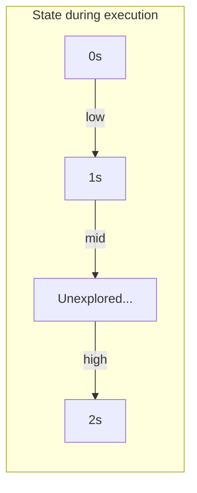

# 01_Arrays: Masterclass Intermediate Examples

In this module, we elevate our thinking from basic linear scans to state machines, dynamic programming on arrays, and space-time tradeoffs using hashing.

---

## Example 1: Sort an Array of 0s, 1s, and 2s (Dutch National Flag)

**Problem Statement:** Given an array `nums` with $n$ objects colored red, white, or blue (represented by 0, 1, and 2 respectively), sort them **in-place** so that objects of the same color are adjacent, with the colors in the order red, white, and blue. You must solve this in one pass ($O(N)$ time) with $O(1)$ extra space.

### The Naive Approaches (What NOT to do)
1. **Sorting (`Arrays.sort`)**: $O(N \log N)$ time. FAANG interviewers will instantly reject this because you aren't utilizing the constraint that there are only 3 distinct values.
2. **Counting Sort (Two Passes)**: Count the 0s, 1s, and 2s in pass 1. Overwrite the array in pass 2. 
   *Interviewer pushback:* "Can you do this in exactly one pass?"

### Optimal Approach: Dijkstra's 3-Way Partitioning
This algorithm relies on maintaining strict **Loop Invariants**. We use three pointers: `low`, `mid`, and `high` to divide the array into 4 distinct regions.

**The Loop Invariants:**
At any point during execution, the array satisfies these 4 conditions:
1. `arr[0]` to `arr[low - 1]`: strictly `0`
2. `arr[low]` to `arr[mid - 1]`: strictly `1`
3. `arr[mid]` to `arr[high]`: **Unexplored space** (unknown values)
4. `arr[high + 1]` to `arr[N - 1]`: strictly `2`

The goal is to shrink the unexplored space (`mid` to `high`) until `mid > high`.



### Production-Grade Java Code
```java
public class DutchNationalFlag {
    public static void sortColors(int[] nums) {
        if (nums == null || nums.length <= 1) return;

        int low = 0;
        int mid = 0;
        int high = nums.length - 1;

        // Condition is <= because the element at 'high' is UNEXPLORED.
        while (mid <= high) {
            switch (nums[mid]) {
                case 0:
                    // Found a 0. Swap it to the 'low' boundary.
                    swap(nums, low, mid);
                    low++;
                    mid++; // We can increment mid because the swapped element from 'low' is guaranteed to be 1 (due to our invariant).
                    break;
                case 1:
                    // Found a 1. It's already in the correct middle section.
                    mid++;
                    break;
                case 2:
                    // Found a 2. Swap it to the 'high' boundary.
                    swap(nums, mid, high);
                    high--;
                    // CRITICAL: We do NOT increment 'mid' here. 
                    // The element swapped from 'high' could be 0, 1, or 2. 
                    // It must be evaluated in the next loop iteration.
                    break;
            }
        }
    }

    private static void swap(int[] arr, int i, int j) {
        int temp = arr[i];
        arr[i] = arr[j];
        arr[j] = temp;
    }
}
```
**Time Complexity:** $O(N)$ (Exactly one pass).
**Space Complexity:** $O(1)$.

---

## Example 2: Maximum Subarray Sum (Kadane's Algorithm)

**Problem Statement:** Given an integer array `nums`, find the contiguous subarray (containing at least one number) which has the largest sum and return its sum.

### The Paradigm Shift: Dynamic Programming on Arrays
The brute force solution is $O(N^3)$ (checking all start and end points and summing them). This can be optimized to $O(N^2)$ by maintaining a running sum. 
Kadane's Algorithm reduces this to $O(N)$ by applying a core Dynamic Programming concept: **Local Optima leading to Global Optima**.

### Mathematical Intuition
For every element at index `i`, we have exactly two choices:
1. Extend the previous subarray sum by adding `arr[i]`.
2. Start a completely new subarray at `arr[i]`.

We choose to start a new subarray **only if** the previous accumulated sum is negative. Why? Because adding a negative number to `arr[i]` will mathematically yield a result smaller than `arr[i]` alone.

### Production-Grade Java Code
```java
public class KadaneAlgorithm {
    public static int maxSubArray(int[] nums) {
        if (nums == null || nums.length == 0) return 0;

        int maxSum = nums[0];
        int currentSum = nums[0];

        for (int i = 1; i < nums.length; i++) {
            // The core DP transition state:
            // Is it better to add to the existing sum, or start fresh from nums[i]?
            currentSum = Math.max(nums[i], currentSum + nums[i]);
            
            // Update the global maximum
            maxSum = Math.max(maxSum, currentSum);
        }

        return maxSum;
    }
}
```

### Edge Case Mastery: The "All Negatives" Trap
Many developers write Kadane's algorithm by initializing `maxSum = 0` and resetting `currentSum = 0` when it drops below zero. 
*If the array is `[-5, -2, -9]`, that flawed approach returns `0` (which isn't even in the array).*
The implementation above correctly returns `-2` because it initializes with `nums[0]` and uses `Math.max()` directly.

---

## Example 3: Two Sum (Space-Time Tradeoffs & Hash Collisions)

**Problem Statement:** Given an array of integers `nums` and an integer `target`, return indices of the two numbers such that they add up to `target`.

### The Tradeoff Matrix
1. **Nested Loops (Brute Force):** Space $O(1)$, Time $O(N^2)$.
2. **Sorting + Two Pointers:** Space $O(1)$, Time $O(N \log N)$. (Requires modifying the original array or returning values instead of original indices).
3. **HashMap:** Space $O(N)$, Time $O(N)$. 

In a FAANG interview, ALWAYS explicitly state this tradeoff before coding. 

### Production-Grade Java Code
```java
import java.util.HashMap;
import java.util.Map;

public class TwoSum {
    public static int[] twoSum(int[] nums, int target) {
        // Initializing with capacity nums.length / 0.75F + 1 prevents internal resizing
        Map<Integer, Integer> complementMap = new HashMap<>((int)(nums.length / 0.75f) + 1);

        for (int i = 0; i < nums.length; i++) {
            int complement = target - nums[i];

            // Amortized O(1) lookup
            if (complementMap.containsKey(complement)) {
                return new int[] { complementMap.get(complement), i };
            }

            complementMap.put(nums[i], i);
        }

        throw new IllegalArgumentException("No two sum solution exists");
    }
}
```

### Deep Systems Knowledge: HashMap Internals
If an interviewer asks, "Is the HashMap solution ALWAYS strictly $O(N)$ time?", the answer is **NO**. 
- In Java, a `HashMap` is an array of Linked Lists (or Red-Black Trees in Java 8+ when bins get too large).
- If multiple elements hash to the same bucket (Hash Collisions), the `containsKey` operation degrades from $O(1)$ to $O(\log K)$ (where $K$ is the number of elements in the bin).
- Therefore, the worst-case time complexity of this "optimal" solution is actually $O(N \log N)$ under severe hash collisions, though it is $O(N)$ *amortized*. 
- By initializing the HashMap with a predefined capacity `(nums.length / 0.75f) + 1`, we prevent the internal $O(N)$ penalty incurred when a HashMap hits its Load Factor (0.75) and has to rehash the entire table.
