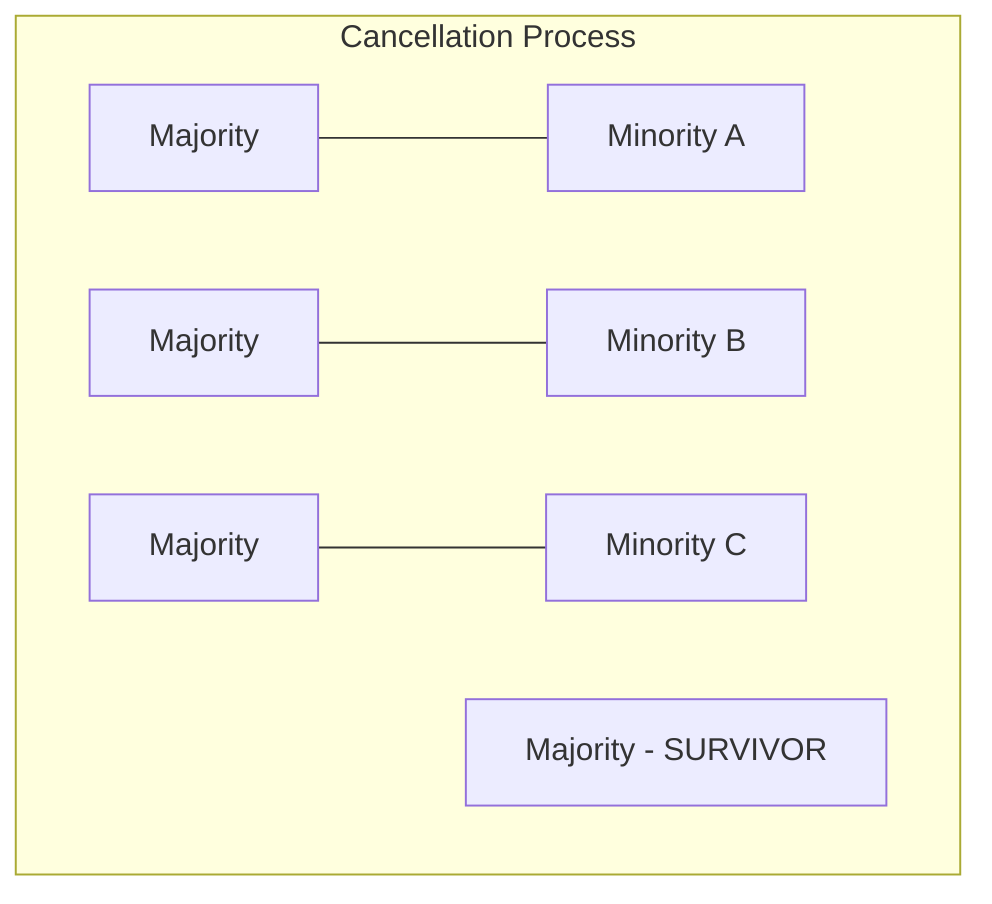

# 01_Arrays: Masterclass Advanced Examples

Advanced array problems at the senior FAANG level rarely test whether you can write a `for` loop. They test whether you can recognize hidden mathematical properties (combinatorics, number theory) and map them to $O(N)$ operations.

---

## Example 1: Majority Element (The Boyer-Moore Voting Algorithm)

**Problem Statement:** Given an array of size $N$, find the majority element. The majority element is the element that appears more than $\lfloor N / 2 \rfloor$ times. You may assume that the majority element always exists in the array.

### The Tradeoff Matrix
1. **HashMap Frequency Count:** Space $O(N)$, Time $O(N)$. Good, but uses extra memory.
2. **Sorting (`Arrays.sort`):** Space $O(1)$ (or $O(N)$ depending on internal pivot/TimSort), Time $O(N \log N)$. Return `arr[N/2]`. 
3. **Boyer-Moore Voting:** Space $O(1)$, Time $O(N)$. The pinnacle of array optimization.

### Mathematical Proof of Boyer-Moore
The algorithm works on a simple principle: **Cancellation**. 
If a number appears more than half the time, if you were to pair every instance of that number with a different number and destroy both, the majority number would *still* be the only one left standing.



We maintain a `candidate` and a `count`. 
- If `count == 0`, we assume the current number is the new `candidate`.
- If the next number equals the `candidate`, `count++`.
- If it does not, `count--` (we cancel them out).

Because the majority element exists $> N/2$ times, it is mathematically impossible for the minorities to fully cancel it out.

### Production-Grade Java Code
```java
public class MajorityElement {
    public static int findMajority(int[] nums) {
        // Assume valid input as per problem statement
        int count = 0;
        Integer candidate = null;

        // Phase 1: Establish the candidate
        for (int num : nums) {
            if (count == 0) {
                candidate = num;
            }
            // Branchless arithmetic optimization (Optional but good to know)
            // count += (num == candidate) ? 1 : -1;
            
            if (num == candidate) {
                count++;
            } else {
                count--;
            }
        }

        // Phase 2: Verification (Crucial if existence is NOT guaranteed)
        // If the problem didn't guarantee a majority element, we MUST do a 2nd pass
        /*
        int actualCount = 0;
        for (int num : nums) {
            if (num == candidate) actualCount++;
        }
        if (actualCount <= nums.length / 2) {
            throw new IllegalArgumentException("No majority element exists");
        }
        */

        return candidate;
    }
}
```

---

## Example 2: Next Permutation (Lexicographical Combinatorics)

**Problem Statement:** Implement *next permutation*, which rearranges numbers into the lexicographically next greater permutation of numbers. If such an arrangement is not possible, it must rearrange it as the lowest possible order (i.e., sorted in ascending order). Must be done in-place with $O(1)$ extra memory.

### Intuition: The Dictionary Approach
Think of permutations like words in a dictionary. `[1, 2, 3]` is "ABC". `[1, 3, 2]` is "ACB". 
How do we find the next word?
1. We read from right-to-left looking for a character that is *smaller* than the character to its right. This is the **Break Point**.
   *Why?* Because any sequence that is strictly decreasing (e.g., `[5, 4, 3]`) is already the highest possible permutation of those digits. You cannot make a larger number by rearranging `5, 4, 3`.
2. Once we find the break point (let's say `index i`), we need to replace it with the next largest number available to its right. We scan right-to-left again to find the first number `> arr[i]`. We swap them.
3. Now, the prefix is correct, but the suffix (everything to the right of `i`) is in descending order (highest possible). To make it the *next* permutation (which means making it as small as possible), we must reverse that suffix into ascending order.

### Visualizing the Algorithm
Given: `[2, 1, 5, 4, 3, 0]`

**Step 1:** Find Break Point (Right to Left)
- `0 < 3` (No)
- `3 < 4` (No)
- `4 < 5` (No)
- `5 < 1` (Wait! `1` is less than `5`. Break Point found at index `1`, value `1`).

**Step 2:** Find Swap Partner (Right to Left)
- Look for first number strictly `> 1`. 
- `0 > 1` (No)
- `3 > 1` (YES! Index `4`, value `3`).

**Step 3:** Swap
- Swap `arr[1]` and `arr[4]`. 
- Array becomes: `[2, 3, 5, 4, 1, 0]`.

**Step 4:** Reverse the Suffix
- The suffix from index 2 onwards is `[5, 4, 1, 0]`. 
- Reverse it: `[0, 1, 4, 5]`.
- Final Result: `[2, 3, 0, 1, 4, 5]`.

### Production-Grade Java Code
```java
public class NextPermutation {
    public static void nextPermutation(int[] nums) {
        if (nums == null || nums.length <= 1) return;
        
        int i = nums.length - 2;
        
        // 1. Find the break point
        while (i >= 0 && nums[i] >= nums[i + 1]) {
            i--;
        }
        
        // If i >= 0, a break point exists (it's not the very last permutation)
        if (i >= 0) {
            int j = nums.length - 1;
            // 2. Find the element just strictly greater than nums[i]
            while (j >= 0 && nums[j] <= nums[i]) {
                j--;
            }
            // 3. Swap them
            swap(nums, i, j);
        }
        
        // 4. Reverse the suffix (from i+1 to end)
        // If i == -1 (was entirely descending), this reverses the whole array
        reverse(nums, i + 1, nums.length - 1);
    }
    
    private static void swap(int[] nums, int i, int j) {
        int temp = nums[i];
        nums[i] = nums[j];
        nums[j] = temp;
    }
    
    private static void reverse(int[] nums, int start, int end) {
        while (start < end) {
            swap(nums, start, end);
            start++;
            end--;
        }
    }
}
```

### Time & Space Complexity
- **Time Complexity:** $O(N)$. In the worst case, finding the break point takes $O(N)$, finding the swap partner takes $O(N)$, and reversing takes $O(N)$. $3N$ operations scales linearly.
- **Space Complexity:** $O(1)$. In-place pointer manipulation prevents heap allocations.
